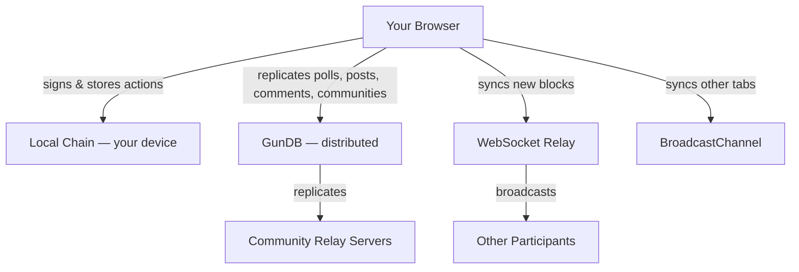
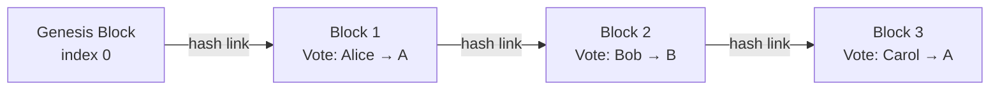

# InterPoll

> **"101% Uptime!!!"** — *A voice for everyone, with records that are harder to erase.*


---

## What is InterPoll?

InterPoll is a **free, open, decentralised polling + discussion platform** — a place where communities can vote, post, comment, and organise without any single company in control.

When you vote, publish a post, or leave a comment on InterPoll, your activity is stored locally first and then shared across the network. No central server owns your community history. Poll results are backed by verifiable receipts, while posts and comments are replicated across peers so they are harder to suppress or quietly erase.

We built InterPoll because we noticed that other platforms censor a lot — and even when they don't, they shadow-ban. On InterPoll, **anyone can create their own community, set their own rules, and design their own experience**. There is no algorithm deciding what you see. There is no central team that can quietly remove your poll.

---

## Why it matters

Traditional online communities share a fundamental weakness: **one server, one point of control**. The company that runs the server can delete a poll, hide a post, remove comments, alter results, or simply go offline. This is as true of small community forums as it is of massive social platforms.

InterPoll takes a different approach:

- 🌐 **No single owner.** Data is spread across every participant's device and a network of relay servers. Anyone can run a relay. Communities can run their own.
- 🔒 **Your vote, signed by you.** Every action you take is cryptographically signed with a key that lives only on your device. No relay or server can forge a vote in your name.
- 💬 **Posts and comments that persist.** Community discussion is replicated across peers and relays, not trapped in a single vendor database.
- 📄 **Verifiable receipts.** After voting you get a short verification code. You can check it in the built-in Chain Explorer at any time to confirm your vote is intact.
- 📴 **Works offline.** Lost your connection? Your votes and local activity are still saved and sync when connectivity returns.
- 🔐 **Private communities.** Sensitive discussions can be fully encrypted so that only invited members can read them — not even the relay server knows the contents.

---

## Key features

| Feature | What it means for you |
|---|---|
| **Tamper-evident voting** | Every vote is chained to the previous one. If anyone tries to alter or delete a record, the entire chain breaks — and it shows. |
| **Public posts & threaded comments** | Run community conversations in the same network: publish updates, debate in comments, and keep context attached to each poll. |
| **Verifiable receipt** | You get a short code after voting. Enter it in the Chain Explorer to confirm your vote was recorded, unchanged. |
| **Offline-first** | Vote even without internet. Your record is kept locally and synced when you reconnect. |
| **Private & encrypted communities** | Create communities where all content is encrypted in your browser. Relay servers see only scrambled data. |
| **No algorithm** | You see what your community posts. No hidden ranking, no shadow-banning, no promoted content. |
| **Community-run relays** | Any group can host its own relay server, giving communities full sovereignty over their data. |
| **Optional login gates** | Poll creators can optionally require a Google or Microsoft login to vote — useful for verified, members-only polls. |
| **Invite-only polls** | Generate single-use invite codes for private polls. Each code can only be used once. |

---

## How it works (plain language)

InterPoll has three layers working together:

**1. Your local chain (the record)**
Votes and key actions are written to a local integrity log in your browser. Each new block links to the previous one using a unique fingerprint (a cryptographic hash). Changing past records would snap the chain — making tampering instantly visible.

**2. The distributed network (the copies)**
Your data — polls, posts, comments, communities, and profiles — is replicated across a distributed database called GunDB. Every connected device holds a copy. If one relay goes down, the data lives on in the others and syncs back up when connectivity returns.

**3. The relay (the messenger)**
A lightweight WebSocket relay helps devices find each other and share updates in real time. Anyone can run a relay. If one relay is blocked or shut down, peers can switch to another. The more relays exist, the more resilient the network becomes.

> **In short:** your polls, posts, comments, and vote history exist on your device, on your peers' devices, and across relay servers — all at once. Erasing them would require erasing every copy simultaneously. That is the core principle: sooner or later, a peer with a copy reconnects and reseeds the network.



---

## Honest about the limits

InterPoll is designed to be **harder to censor and tamper with than a single-server platform** — not impossible. Here is what that means in practice:

- Data survives as long as **at least one honest participant** retains a copy and later reconnects.
- The relay server can **delay or censor** messages, but it **cannot forge** a vote or signed action from your device key.
- Anti-fraud controls (device fingerprinting, two-phase vote authorization, invite codes, OAuth gating) **raise the cost** of duplicate voting — they do not provide one-human-one-vote mathematical guarantees.
- **Private communities** encrypt content in your browser. The encryption is strong (AES-256-GCM), but if you lose your key, there is no recovery.

For the full technical threat model, see [**`docs/protocol-whitepaper.md`**](docs/protocol-whitepaper.md).

---

## Get involved

**Run a peer** — the simplest way to strengthen the network. Running `peer.js` on any laptop adds another copy of the data and helps other participants sync faster.

```bash
node peer.js
```

**Run a relay** — give your community full data sovereignty. See `gun-relay/` for the GunDB relay and `relay-server.js` for the WebSocket relay.

**Contribute code** — open a PR. The project is fully open source.

---

## Quick start (for developers)

You need two things running: the frontend dev server and the relay server.

```bash
chmod +x run.sh
./run.sh
```

The app opens at `http://localhost:5173`. The relay listens on port 8080.

### Environment variables

**Frontend** (prefix with `VITE_`, set at build time):

| Variable | Default | Purpose |
|---|---|---|
| `VITE_WS_RELAY_URL` | `ws://localhost:8080` | WebSocket relay |
| `VITE_GUN_RELAY_URL` | `http://localhost:8765/gun` | GunDB relay |
| `VITE_API_BASE_URL` | `http://localhost:8080` | Backend API |

Relay URLs can also be changed at runtime from the Settings page (saved in `localStorage`).

**Relay server** (set in environment):

| Variable | Default | Purpose |
|---|---|---|
| `FRONTEND_ORIGIN` | `http://localhost:5173` | CORS origin |
| `SERVER_ORIGIN` | `http://localhost:8080` | Public relay origin used for OAuth callback URIs (required and must be HTTPS in production) |
| `JWT_SECRET` | random per process | HMAC secret for relay session JWTs |
| `VOTE_RESERVATION_SECRET` | random per process | HMAC secret for vote reservation tokens |
| `GOOGLE_CLIENT_ID` | — | Google OAuth app ID |
| `GOOGLE_CLIENT_SECRET` | — | Google OAuth secret |
| `MS_CLIENT_ID` | — | Microsoft OAuth app ID |
| `MS_CLIENT_SECRET` | — | Microsoft OAuth secret |
| `MS_TENANT` | `common` | Azure AD tenant |

OAuth is optional — the app works without it. It is only required for polls that enforce a login-to-vote policy.

Use `.env.example` as a template. Keep real `.env` files and data directories out of git.

### Build commands

```bash
npm run dev       # Start Vite dev server
npm run build     # Type-check + production build
npm run preview   # Serve the built dist/ folder locally
npm test          # Run the Vitest test suite
```

---

## Technical deep-dive

For an implementation-aligned protocol specification — including the full block structure, vote flow, sync protocol, encryption details, relay trust model, and threat model — read the whitepaper:

📄 **[`docs/protocol-whitepaper.md`](docs/protocol-whitepaper.md)**

### Project layout

```
src/
  components/     UI components (VoteForm, PollCard, PostCard, etc.)
  views/          Page-level components (HomePage, VotePage, SettingsPage, etc.)
  services/       Core logic — blockchain, GunDB, WebSocket, crypto, storage
  stores/         Pinia state stores (chainStore, pollStore, communityStore, etc.)
  router/         Vue Router configuration
  config.ts       Centralised config with runtime-mutable relay URLs

relay-server.js                          Dev WebSocket relay + OAuth + vote authorization
relay-server/relay-server-enhanced.js   Production PM2 relay with persisted vote registry
gun-relay/gun-relay.js                  GunDB relay server
```

### Key services

| File | Responsibility |
|---|---|
| `chainService.ts` | Block creation, hashing, signing, chain validation |
| `gunService.ts` | GunDB read/write/subscribe wrapper |
| `websocketService.ts` | WebSocket connection, peer discovery, server-list sharing |
| `broadcastService.ts` | Cross-tab sync via BroadcastChannel |
| `pollService.ts` | Poll CRUD, invite code generation and validation |
| `voteTrackerService.ts` | Device fingerprinting, duplicate-vote prevention |
| `cryptoService.ts` | SHA-256 hashing, verification code generation |
| `auditService.ts` | OAuth login/logout, backend vote authorization |
| `storageService.ts` | IndexedDB wrapper for blocks, votes, receipts |
| `encryptionService.ts` | AES-256-GCM community/content encryption |
| `keyVaultService.ts` | Local key storage and export/import |
| `ipfsService.ts` | Image compression, upload, and retrieval via GunDB |

### Vote flow



1. Vote payload is created and hashed (SHA-256).
2. A new block is appended — linked to the previous block's hash.
3. The block is signed with your device key and saved locally.
4. A receipt with a short verification code is generated.
5. The block is broadcast to peers via WebSocket and BroadcastChannel.
6. The relay two-phase authorization path (`/api/vote-authorize` → `/api/vote-confirm`) prevents duplicate registration backend-side.

### Anti-fraud layers

- **Device fingerprinting** — a SHA-256 hash of browser properties creates a persistent device ID.
- **Two-phase backend authorization** — the relay issues a short-lived reservation token; only confirming with that token commits the vote to the registry.
- **Invite codes** — single-use codes, consumed atomically in GunDB on use.
- **OAuth gating** — optional Google or Microsoft login required to vote.
- **Rate limiting and bot scoring** — reduces automated spam.
- **Proof-of-Work (optional)** — raises the cost of high-frequency message floods.
