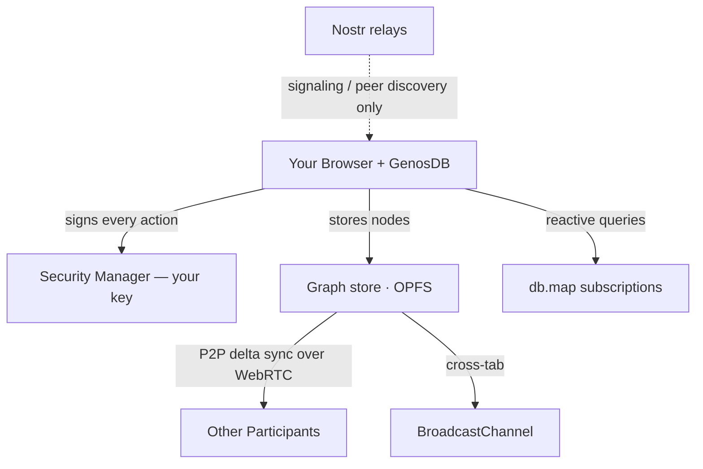

# InterPoll

> **"101% Uptime!!!"** — *A voice for everyone, with records that are harder to erase.*

> ### ▶️ [**Live demo**](https://estebanrfp.github.io/interpoll-genosdb/)
> Try it now: **https://estebanrfp.github.io/interpoll-genosdb/** — a running, serverless
> build (GitHub Pages). Open it in two browsers to watch polls and votes sync peer-to-peer,
> with no backend in between.


> ### 🛰️ A GenosDB build of InterPoll — shared as a friendly contribution
> This repository is a fork of [**theEndless11's InterPoll**](https://github.com/theEndless11/decentralised),
> rebuilt end-to-end on **[GenosDB](https://github.com/estebanrfp/gdb)** to show how
> the very same app runs on a single peer-to-peer database — **one dependency, zero
> servers, signed by default**. It's offered as a gift and a showcase, not a
> replacement: all credit for InterPoll goes to its original author.
> See **[`WHY-GENOSDB.md`](WHY-GENOSDB.md)** for exactly what changed and why.

---

## What is InterPoll?

InterPoll is a **free, open, decentralised polling + discussion platform** — a place where communities can vote, post, comment, and organise without any single company in control.

When you vote, publish a post, or leave a comment on InterPoll, your activity is stored locally first and then synced peer-to-peer across the network. No central server owns your community history. Poll results are backed by verifiable, cryptographically signed receipts, while posts and comments are replicated across peers so they are harder to suppress or quietly erase.

We built InterPoll because we noticed that other platforms censor a lot — and even when they don't, they shadow-ban. On InterPoll, **anyone can create their own community, set their own rules, and design their own experience**. There is no algorithm deciding what you see. There is no central team that can quietly remove your poll.

---

## Why it matters

Traditional online communities share a fundamental weakness: **one server, one point of control**. The company that runs the server can delete a poll, hide a post, remove comments, alter results, or simply go offline.

InterPoll takes a different approach, powered by **[GenosDB](https://github.com/estebanrfp/gdb)** — a peer-to-peer graph database with built-in cryptographic identity:

- **No single owner.** Data lives on every participant's device and syncs directly peer-to-peer. There is no backend to capture or shut down.
- **Your vote, signed by you.** Every action is cryptographically signed by an identity that lives only on your device. No peer can forge a vote or post in your name.
- **Posts and comments that persist.** Community discussion is replicated across peers, not trapped in a single vendor database.
- **Verifiable receipts.** After voting you get a short verification code. Check it in the built-in Chain Explorer any time to confirm your vote is intact.
- **Works offline.** Lost your connection? Your activity is saved locally and syncs automatically when you reconnect.
- **Private communities.** Sensitive discussions are encrypted in your browser so only invited members can read them.

---

## Key features

| Feature | What it means for you |
|---|---|
| **Cryptographically signed actions** | Every vote, post and comment is signed by your device identity and verified by peers. Forgery is impossible without your key. |
| **Tamper-evident history** | Actions are ordered by a Hybrid Logical Clock and recorded as signed nodes. Altering the past would invalidate the signatures — and it shows. |
| **Public posts & threaded comments** | Run community conversations alongside polls: publish updates, debate in threads, keep context attached to each topic. |
| **Verifiable receipt** | Get a short code after voting. Enter it in the Chain Explorer to confirm your vote was recorded, unchanged. |
| **Offline-first** | Vote without internet. Your record is stored locally (OPFS) and synced when you reconnect. |
| **Private & encrypted communities** | Create communities whose content is AES-encrypted in your browser; peers only ever see ciphertext. |
| **No algorithm** | You see what your community posts. No hidden ranking, no shadow-banning, no promoted content. |
| **Invite-only polls** | Generate single-use invite codes for private polls. Each code can only be used once. |
| **Passkey or recovery phrase** | Protect your identity with a WebAuthn passkey (biometrics / hardware key) or a 12-word BIP39 recovery phrase. |

---

## How it works (plain language)

InterPoll runs entirely on **GenosDB** — there are no servers to operate:

**1. Your identity (the key)**
On first use you generate an identity that lives only on your device, protected by a passkey or a recovery phrase. It signs every action automatically. Peers verify those signatures, so nobody can act as you.

**2. The graph (the data)**
Polls, votes, posts, comments, communities and profiles are stored as nodes in a local graph, persisted to your browser's high-performance OPFS storage. Each vote is its own signed node, so concurrent votes never overwrite each other — tallies are derived, not mutated.

**3. The mesh (the sync)**
GenosDB connects peers directly over WebRTC, using decentralised Nostr relays only for discovery (signaling) — never for your data. Changes propagate peer-to-peer in real time, and across your own browser tabs instantly. At scale, an optional cellular-mesh mode (**Cells**) keeps large communities fast by cutting the number of peer connections by orders of magnitude versus a full mesh (the docs cite roughly 100×–1000× fewer for large networks).

> **In short:** your polls, posts, comments and vote history exist on your device and on your peers' devices at once. Erasing them would mean erasing every copy simultaneously — sooner or later, a peer with a copy reconnects and reseeds the network.



---

## Honest about the limits

InterPoll is designed to be **harder to censor and tamper with than a single-server platform** — not impossible:

- Data survives as long as **at least one honest peer** keeps a copy and later reconnects.
- A signature **cannot be forged** without your device key; peers reject any unsigned or invalidly-signed operation.
- One-identity-one-vote is enforced per signing identity plus single-use invite codes for private polls — this **raises the cost** of duplicate voting but is not a one-human-one-vote mathematical guarantee.
- **Private communities** encrypt content in your browser (AES-256-GCM). The encryption is strong, but if you lose your key there is no recovery.

---

## Quick start (for developers)

InterPoll is a pure client app — **no backend, no relay server to run.**

```bash
pnpm install
pnpm dev
```

The app opens at `http://localhost:5173`.

### Build commands

```bash
pnpm dev       # Start the Vite dev server
pnpm build     # Production build
pnpm preview   # Serve the built dist/ folder locally
pnpm test      # Run the Vitest test suite
```

> **Bundler note:** GenosDB ships a self-contained `dist/` and resolves its own modules (Security Manager, GenosRTC, …) at runtime via `import(new URL('./*.min.js', import.meta.url))`. Rather than bundling it, the app loads it **intact from a single served folder** (`<base>/genosdb/`): a small `genosdb-static` Vite plugin serves that folder from `node_modules` in dev and copies it verbatim into the build. `build.target` is `es2022` (for GenosDB's top-level `await`).

---

## Technical overview

### Stack

Vue 3 + Ionic + Pinia + Vite on the front end; **GenosDB** for data, identity and P2P sync. Installing GenosDB pulls **zero transitive dependencies**.

### Data model

Everything is a signed GenosDB node, queried reactively with `db.map`:

| Node type | Purpose |
|---|---|
| `poll`, `vote` | A poll and its individual signed votes (tallies derived) |
| `post`, `postVote` | A post and its up/down votes |
| `comment`, `commentVote` | Threaded comments (via `parentId`) and their votes |
| `community`, `membership` | Communities and signed memberships (member count derived) |
| `chatRoom`, `chatMessage`, `dm` | Encrypted group rooms and direct messages |
| `user` | Profiles keyed by the signing Ethereum address |
| `chainAction`, `receipt` | The tamper-evident action log and verifiable receipts |
| `image` | Compressed images stored as nodes |

### Key services

| File | Responsibility |
|---|---|
| `gdbServices.ts` | The single GenosDB instance (identity + P2P + storage) and network status |
| `userService.ts` | Profiles keyed by the active signing identity |
| `pollService.ts` | Polls and signed, one-per-identity votes with derived tallies |
| `postService.ts` / `commentService.ts` | Posts and threaded comments with signed voting |
| `communityService.ts` | Communities, derived membership, private (encrypted) communities |
| `chatService.ts` / `chatRoomService.ts` | E2E direct messages and encrypted group rooms |
| `trustService.ts` | Verified usernames via external trust issuers |
| `encryptionService.ts` / `keyVaultService.ts` | AES-256-GCM encryption and local key vault |
| `ipfsService.ts` | Image compression and node storage |
| `moderationService.ts` | Content filtering (word lists, karma thresholds) |
| `searchService.ts` | Local full-text search over the graph |

### How a vote works

1. You select an option; the app records a **signed `vote` node** keyed `pollId:yourAddress` (one vote per identity — re-voting updates it in place).
2. The Security Manager signs the operation automatically and peers verify it on receipt.
3. The poll's tally is **derived** by aggregating its vote nodes — there are no shared counters to race on.
4. A receipt with a short verification code is recorded for the Chain Explorer.
5. The node syncs to peers in real time over WebRTC and to your other tabs via BroadcastChannel.

### Project layout

```
src/
  components/   UI components (VoteForm, PollCard, PostCard, OnboardingModal, …)
  views/        Page-level components (HomePage, VotePage, SettingsPage, …)
  services/     Data + identity logic, all backed by GenosDB
  stores/       Pinia state stores (pollStore, postStore, communityStore, …)
  router/       Vue Router configuration
  config.ts     Centralised app configuration
```
